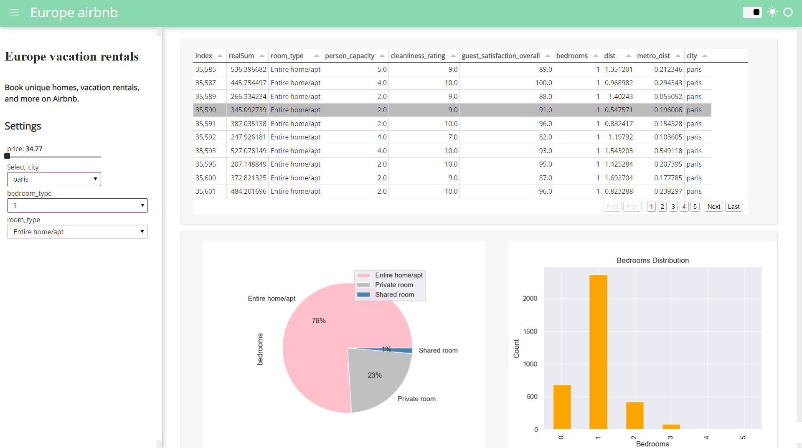

## Dashboard

 
### hi,i did a mini project using python pandas on Airbnb dataset,
1.Created a jupyter Notebook
2.Gather and load data
3.Understand data
4.Clean and organized the data
5.Did data visualization
6.Used bar,scatter,pie and more charts 
7.Created a dashboard (interactive dashboard,using hvPlot)
